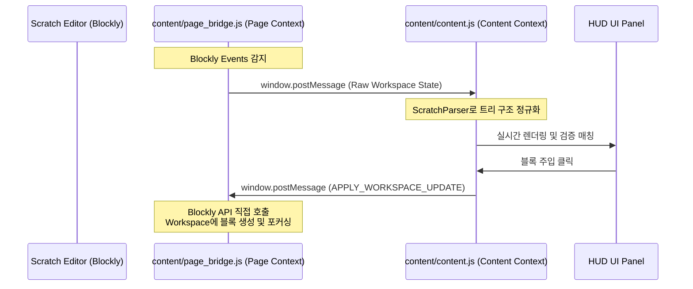

# 🧩 Scratch HUD Coach (스크래치 HUD 코치)

> **Scratch 3.0 에디터용 코칭 HUD: 실시간 도움말, 체크리스트, 레퍼런스 블록 주입 및 AI 가이드북 연동**

`Scratch HUD Coach`는 스크래치 3.0(Scratch 3.0) 환경에서 학생들의 자기주도 학습과 교사의 피드백 제공을 돕기 위해 개발된 크롬 브라우저 확장 프로그램(Chrome Extension)입니다. 스크래치 웹 에디터 화면에 직관적인 HUD(Head-Up Display) 패널을 오버레이하여 실시간 과제 채점, 블록 주입, 코멘트 스캐폴딩 등 다양한 교육용 편의 기능을 제공합니다.

---

## 🌟 주요 기능 (Key Features)

### 1. 📺 실시간 오버레이 HUD 패널
* 스크래치 프로젝트 에디터 화면 오른쪽(또는 왼쪽)에 플로팅 윈도우 형태로 결합됩니다.
* 단축키(`Ctrl+Shift+U` / Mac `Cmd+Shift+U`) 또는 브라우저 액션 팝업을 통해 편리하게 토글할 수 있습니다.
* Glassmorphism 테마의 깔끔하고 모던한 UI를 제공합니다.

### 2. 🤖 AI 가이드북 및 프롬프트 생성기 (Scaffolding)
* **최초 뼈대 가이드북 (Initial Blueprint)**: 스크래치 코드를 분석하여 프로젝트 개요와 스프라이트별 단계 요약을 담은 단일 JSON 가이드를 작성하도록 AI 프롬프트를 자동 복사합니다.
* **상세 블록 조립 가이드 (Detail Guide)**: 대상 스프라이트들을 선택하여 각 블록의 상세 조립 방법과 힌트가 들어있는 주석 프롬프트를 추출합니다.
* **난이도 및 스타일 선택**:
  * **기초 단계(직접 지시형)** vs **심화 단계(간접 미션형)**
  * **텍스트 리스트(기본형)** vs **유사 블록 구조(시각화형)**

### 3. 🧩 레퍼런스 블록 주입기 (Reference Block Injector)
* 교사 혹은 시스템이 제공하는 정답/템플릿 블록 코드를 스크래치 에디터에 즉시 주입합니다.
* **스마트 배치**: 기존 조립된 블록들과 겹치지 않도록 Y축 좌표값(`x: 80, y: maxY + 100`)을 자동으로 계산하여 안전하게 추가합니다.
* **부드러운 시점 포커스 (Smooth Viewport Transition)**: 블록 주입 후 뷰포트가 갑자기 튀지 않고, 인지적 부하를 줄이기 위해 `400ms` 동안 Expo Out (`cubic-bezier(0.16, 1, 0.3, 1)`) 곡선을 타며 부드럽게 스크롤되어 블록의 중앙으로 포커싱을 맞춥니다. 모션 감소 설정(`prefers-reduced-motion: reduce`) 환경에서는 지체 없는 인스턴트 스크롤로 대체 동작합니다.
* **미니 블록 프리뷰**: 주입하기 전 템플릿의 형태를 스크래치 카테고리 색상 테마가 적용된 미니 프리뷰 형태로 미리 확인할 수 있습니다.
* **스프라이트 대조 및 폴백**: 현재 선택된 스프라이트와 템플릿 대상 스프라이트가 다를 경우 경고를 표시하고, 현재 선택된 곳에 안전하게 우회 주입합니다.

### 4. 📝 AI 가이드북 주석 주입 및 관리
* AI가 출력한 가이드북 JSON을 입력하면 스프라이트 단위로 `[🚀 즉시 주입]`, `[📋 텍스트 복사]`를 수행합니다.
* Blockly Workspace API를 직접 호출하여, 블록과 연동된 **말풍선 주석(Blockly.Comment)**을 접힌 상태(`minimized: true`)로 에디터에 생성/주입해 줍니다.
* 블록 코드는 건드리지 않은 채 말풍선 주석만 일괄 제거하는 **[🗑️ 가이드 주석만 지우기]** 기능을 제공하여 워크스페이스를 깨끗하게 관리할 수 있습니다.

### 5. 🟢 과제 검증 시스템 (Mission Validation System)
* 학생이 블록을 움직일 때마다 Blockly 변경 이벤트를 실시간 감지하여 조립 트리를 분석합니다.
* 사전에 옵션 페이지에 입력된 **과제 규칙 JSON(Mission Rules)**과 비교하여 미션 성공/실패 여부를 채점하고 HUD 체크리스트에 통과 여부를 실시간으로 반영합니다.
* 트리 재귀 순회(Pre-order Traversal) 및 범위 비교 기능(`min`/`max`)을 내장하여 단순 구조 비교를 넘어 값 검증까지 완벽 지원합니다.

### 6. 🧹 유령 주석(Ghost Comment) 청소
* 스크래치 에디터 내부에서 블록이 삭제된 후에도 메모리나 뷰 상에 잔상처럼 남는 유령 주석(부모가 없는 주석)을 감지하고 일괄적으로 깨끗이 정리합니다.

---

## 📂 프로젝트 구조 (Project Directory Structure)

```
Scratch-HUD-Coach/
├── manifest.json                     # Chrome 확장 프로그램 설정 파일 (Manifest V3)
├── background/
│   └── service_worker.js             # 백그라운드 서비스 워커 (스크린샷 및 커맨드 허브)
├── content/                          # 스크래치 페이지에 로드되는 스크립트 및 스타일
│   ├── content.js                    # HUD UI 레이아웃, 상태 관리 및 코어 중재자
│   ├── page_bridge.js                # 웹 페이지 컨텍스트에서 Scratch VM/Blockly 인스턴스 직접 제어
│   ├── parser.js                     # Scratch VM 블록 ↔ 정규화된 트리 JSON 파서
│   ├── injector.js                   # 레퍼런스 블록 템플릿 파싱, 프리뷰 렌더링 및 주입기
│   ├── ui_utils.js                   # 토스트 메시지 렌더링, 클립보드 제어 등 공통 UI 유틸
│   ├── hud_template.js               # HUD 사이드바 패널 HTML 템플릿 문자열
│   └── hud.css                       # HUD 패널, 탭, 미니 블록 프리뷰, 토스트 애니메이션 CSS
├── popup/
│   ├── popup.html                    # 확장 프로그램 아이콘 클릭 시 노출되는 팝업 UI
│   └── popup.js                      # 팝업 UI 바인딩 및 백그라운드 중계
├── options/
│   ├── options.html                  # 확장 프로그램 상세 설정 페이지 (옵션)
│   └── options.js                    # 설정 저장 및 로드 제어
├── resource/                         # 스크래치 카테고리별 레퍼런스 블록 JSON 템플릿들
│   ├── 01_동작.json
│   ├── 02_형태.json
│   └── ... (03~10 카테고리 JSON 포함)
├── SKILL.md                          # AI 용 Scratch 코드 생성 JSON 스키마 가이드북
├── mission_validation_system.md      # 과제 실시간 검증 시스템 상세 기술 설계안
├── comment_injection_plan.md         # 가이드북 기반 주석 주입 및 관리 기능 구현 플랜
└── reference_block_injector.md       # 레퍼런스 블록 주입 기능 설계 및 아키텍처 명세서
```

---

## 🛠️ 기술 아키텍처 (Technical Architecture)

본 프로그램은 크롬 익스텐션의 격리된 실행 환경인 **콘텐츠 스크립트(Content Script) 컨텍스트**와 스크래치가 실제로 실행되는 **웹 페이지(Web Page) 컨텍스트** 간의 통신 장벽을 극복하기 위해 `Message Bridge` 아키텍처를 차용했습니다.



### 핵심 내부 컴포넌트
1. **`page_bridge.js` (Page Context)**:
   * 스크래치 내부의 전역 변수인 `window.scratch` 및 Blockly Workspace에 직접 접근하기 위해 `content/page_bridge.js`를 웹 페이지의 `<script>` 태그로 주입(Inject)합니다.
   * `Blockly.getMainWorkspace().addChangeListener`를 통해 실시간으로 변동 사항을 모니터링합니다.
2. **`parser.js` (Content Context)**:
   * Scratch VM이 들고 있는 복잡한 ID 기반의 평면적 블록 딕셔너리를 논리적으로 해독하기 편한 **2차원 정규 트리 배열(JSON)**로 전환합니다. AI 생성 및 검증 시 이 표준 트리 구조를 이용합니다.
3. **`injector.js` (Content Context)**:
   * `resource/*.json` 파일에 지정된 카테고리별 레퍼런스 코드를 비동기로 패치하고, 이 데이터를 미니 블록 프리뷰 HTML로 렌더링합니다. 주입 요청이 발생하면 `page_bridge.js`에 주입을 요청하고 결과를 모니터링합니다.

---

## 🚀 설치 및 사용 방법 (Installation & Usage)

### 1. 개발자 모드로 확장 프로그램 설치
1. 본 레포지토리를 로컬 PC에 복사(Clone 또는 Download)합니다.
2. 크롬(Chrome) 브라우저를 열고 주소창에 `chrome://extensions/`를 입력하여 이동합니다.
3. 우측 상단의 **[개발자 모드]** 스위치를 활성화합니다.
4. 좌측 상단의 **[압축해제된 확장 프로그램을 로드합니다]** 버튼을 클릭합니다.
5. `Scratch HUD Coach` 프로젝트 폴더(즉, `manifest.json`이 들어있는 폴더)를 선택하여 등록합니다.

### 2. 스크래치 에디터 실행 및 HUD 사용
1. [스크래치 웹 에디터](https://scratch.mit.edu/projects/editor) 또는 프로젝트 생성 페이지로 이동합니다.
2. 화면 오른쪽 상단에 **🚀 HUD 코치 열기** 플로팅 버튼이 생기거나, 단축키 `Ctrl+Shift+U` (Mac: `Cmd+Shift+U`)를 눌러 HUD 사이드바 패널을 활성화합니다.
3. **블록 주입기 탭**에서 필요한 레퍼런스 카테고리(동작, 형태 등)를 선택하고 원하는 블록 코드를 **[🧩 주입하기]** 버튼으로 삽입할 수 있습니다.
4. **가이드북 탭**에서 AI를 연동해 맞춤형 질문 전 자기점검 카드 생성 및 주석 말풍선을 주입받아 실습을 진행합니다.

---

## ⚙️ 과제 규칙 설정 방법 (Mission JSON)

확장 프로그램 아이콘을 클릭한 뒤 **[상세 옵션]**으로 진입하거나 `options/options.html`을 통해 과제 기준을 실시간으로 지정할 수 있습니다.
규칙 포맷은 다음과 같으며, 특정 스프라이트에 존재해야 할 블록의 패턴(오코드, 값 범위 등)을 정의합니다.

```json
{
  "missionId": "burger_game_step1",
  "title": "접시 클릭으로 게임 시작하기",
  "criteria": [
    {
      "id": "c1",
      "description": "접시 스프라이트를 클릭했을 때 '고기생성' 신호를 보냅니다.",
      "type": "STRUCTURE",
      "targetSprite": "접시",
      "rule": {
        "opcode": "event_whenthisspriteclicked",
        "next": {
          "opcode": "event_broadcast",
          "fields": {
            "BROADCAST_OPTION": "고기생성"
          }
        }
      }
    }
  ]
}
```

---

## 📄 참고 문서 및 설계 사양

* 📜 **[SKILL.md](file:///c:/Users/osw/Desktop/Workspace/Projects/Scratch%20HUD%20Coach/SKILL.md)**: AI가 이해할 수 있는 정규화 트리 JSON 스키마 정보 및 Opcode 매칭 예시
* 📜 **[mission_validation_system.md](file:///c:/Users/osw/Desktop/Workspace/Projects/Scratch%20HUD%20Coach/mission_validation_system.md)**: 학생들의 조립 상태를 실시간 채점하는 검증 알고리즘과 로드 모델(A/B/C) 설계서
* 📜 **[comment_injection_plan.md](file:///c:/Users/osw/Desktop/Workspace/Projects/Scratch%20HUD%20Coach/comment_injection_plan.md)**: 가이드북 탭에서의 AI 주석 주입, 텍스트 가이드 복사 및 격리 규칙 구현 플랜
* 📜 **[reference_block_injector.md](file:///c:/Users/osw/Desktop/Workspace/Projects/Scratch%20HUD%20Coach/reference_block_injector.md)**: 겹치지 않는 스마트 주입 좌표 계산, 뷰포트 포커싱, 미니 프리뷰 디자인 관련 기술 명세서
