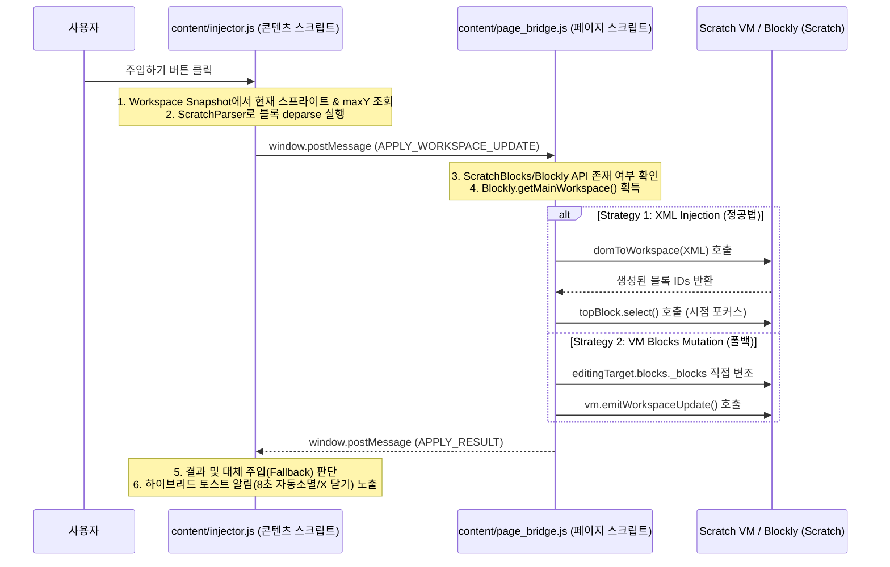

# 🧩 레퍼런스 블록 주입기 (Reference Block Injector Tool)

스크래치 HUD 코치 확장 프로그램의 **레퍼런스 블록 주입기** 기능에 대한 기술 명세 및 가이드 문서입니다.

---

## 1. 개요 (Overview)
- **목적**: 학생이 AI 프롬프트나 가이드를 복사하여 외부에서 수동으로 입력하는 대신, 확장 프로그램 내 제공되는 검증된 **레퍼런스 블록(JSON 템플릿)**을 현재 스크래치 편집 영역에 즉시 주입해 실습을 지원하는 도구입니다.
- **주요 특징**:
  - 기존 블록과 겹치지 않는 스마트 배치 좌표 연산
  - 주입된 블록으로 자동 시점 이동(포커스)
  - 타겟 스프라이트 불일치 시 경고를 동반한 강제 주입(폴백) 및 하이브리드 토스트 알림
  - 스크래치 블록 형태와 유사한 미니 블록 프리뷰 렌더링

---

## 2. 시스템 아키텍처 (Architecture)

블록 주입기는 **콘텐츠 스크립트 컨텍스트**와 스크래치 VM 및 Blockly가 실행되는 **웹 페이지 컨텍스트** 간의 통신(Message Bridge)을 통해 유기적으로 동작합니다.

---

## 3. 세부 기능 구현 (Technical Details)

### A. 스마트 좌표 배치 (`page_bridge.js`, `injector.js`)
- 주입 실행 전, 콘텐츠 스크립트(`injector.js`)가 수집된 스냅샷 데이터(`currentSnapshot`)를 바탕으로 현재 선택된 스프라이트 내 최하단 블록의 Y 좌표(`maxY`)를 계산합니다.
- 새로운 블록 시퀀스는 **`x: 80, y: maxY + 100`** 좌표를 기준으로 주입되므로 기존 블록과 절대 겹치지 않습니다.
- 주입이 완료되면 Blockly API의 `ws.getBlockById(newBlockIds[0]).select()`를 호출하여 사용자의 편집 시점을 새로 생성된 블록 위치로 자동 정렬합니다.

### B. 스프라이트 대조 및 폴백 배너 (`injector.js`)
- **스프라이트 대조**: 템플릿 JSON에 지정된 스프라이트(`targetSprite`)와 현재 사용자가 선택하고 있는 스프라이트(`editingTargetName`)를 비교합니다.
- **폴백 주입**: 스프라이트가 일치하지 않더라도 오류를 내며 중단하는 대신, 현재 선택된 스프라이트에 블록을 강제로 주입합니다.
- **하이브리드 토스트 배너**: 
  - 주입이 성공하면 녹색(`success`) 토스트, 폴백 모드로 주입되면 황색(`warning`) 안내 배너가 표시됩니다.
  - 배너는 **8초 후 자동으로 소멸**되지만, **[X] 수동 닫기 버튼**을 제공해 즉시 닫을 수 있습니다.

### C. 미니 블록 프리뷰 렌더링 (`injector.js`, `hud.css`)
- `resource/*.json` 파일에 담겨 있는 원래 형태의 스크래치 시퀀스를 실시간 파싱하여 최대 3개의 블록에 대해 스크래치 테마 스타일의 프리뷰를 보여줍니다.
- 카테고리(motion, looks, control, events 등)에 매핑되는 CSS 클래스를 정의해 시각적으로 원래 스크래치 블록과 동일한 느낌을 줍니다.

---

## 4. 파일 구조 및 역할 (File Structure)

| 파일 경로 | 역할 및 주요 수정 내용 |
| :--- | :--- |
| **[manifest.json](file:///c:/Users/osw/Desktop/Workspace/Projects/Scratch%20HUD%20Coach/manifest.json)** | `content/injector.js` 콘텐츠 스크립트 추가 등록, `resource/*.json`에 외부 접근 권한(`web_accessible_resources`) 부여 |
| **[content.js](file:///c:/Users/osw/Desktop/Workspace/Projects/Scratch%20HUD%20Coach/content/content.js)** | HUD 전체 UI에 탭바 DOM 및 가이드북/블록 주입기 탭 전환 이벤트 리스너 통합 |
| **[hud.css](file:///c:/Users/osw/Desktop/Workspace/Projects/Scratch%20HUD%20Coach/content/hud.css)** | Glassmorphic 탭 디자인, 하이브리드 토스트 애니메이션, 미니 스크래치 블록(카테고리 색상 지정) CSS 추가 |
| **[injector.js](file:///c:/Users/osw/Desktop/Workspace/Projects/Scratch%20HUD%20Coach/content/injector.js)** | [NEW] 템플릿 Fetch, 파싱 및 프리뷰 UI 빌드, 스프라이트 검사 및 주입 트리거, 하이브리드 알림 기능 담당 |
| **[page_bridge.js](file:///c:/Users/osw/Desktop/Workspace/Projects/Scratch%20HUD%20Coach/content/page_bridge.js)** | workspace 스냅샷 전송 시 `editingTargetName` 추가, 블록 주입 후 `select()`를 활용한 시점 포커스 및 결과 메시지 전달 |

---

## 5. 실행 및 관리 지침
1. **템플릿 추가 및 갱신**:
   - `resource/` 내부에 새로운 카테고리 JSON 파일(예: `11_추가기능.json`)이 생기면, `injector.js` 상단 `CATEGORIES` 상수에 객체를 추가하는 것으로 손쉽게 UI에 바인딩할 수 있습니다.
2. **이름 매핑**:
   - `injector.js` 내 `getOpcodeLabel(opcode)` 함수를 확장하여, 스크래치의 다양한 opcode에 대한 한국어 설명을 지속적으로 추가/갱신할 수 있습니다.
